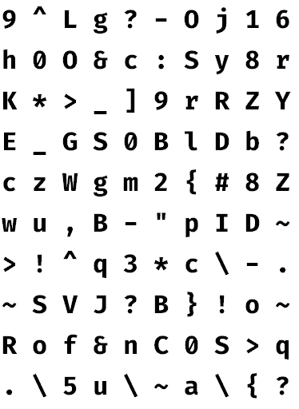
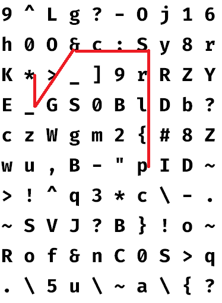

# Kaguya
Nowadays we need to remember many user IDs and passwords. Kaguya provides a new method to remember passwords.

## Method

### 1. Make a square made of random letters

### 2. Connect characters with a single line. You just remember how to connect.

In this case, the password will be "**p{lrS:c&>_\***"

### 3. Create this square for each account you log in, and there is no need to change the connection

## Tools
